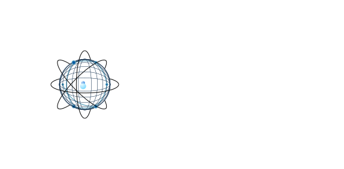

> **Status**: Active Development - (Fall 2024)  
> **First Target Completion**: December 24, 2024 

A high-performance quantum network simulator written in Rust, designed for educational purposes and cross-simulator validation.

---

## Project Vision

QComNetSim aims to create a small-scale, educational quantum network simulator that addresses common limitations in existing simulators while providing built-in validation capabilities. Unlike large-scale simulators, QComNetSim focuses on:

- **Educational clarity**: 4-5 node networks with well-documented, understandable code
- **Performance**: Leveraging Rust for speed and memory safety
- **Validation-first design**: Built-in comparison with established simulators
- **Modular architecture**: Easy to extend and modify for research

## Development Roadmap

*(This will be updated weekly)*

### Semester 1 (Fall 2024)
- [x] Project architecture design
- [x] Core library setup
- [x] Basic quantum state representation
- [x] 2-node linear entanglement generation
- [ ] TOML Configuration file support
- [ ] Add Realistic Noise & Loss Model
- [ ] Validation against SeQUeNCe
- [ ] CLI interface with CSV output
- [ ] 3-node entanglement swapping
- [ ] BB84 protocol (basic implementation)

### Semester 2 (Spring 2025)
- [ ] Graphical user interface
- [ ] Extended protocol support
- [ ] Performance benchmarking suite
- [ ] Comprehensive documentation
- [ ] Advanced noise models

## Motivation

Existing quantum network simulators have various trade-offs:

**SeQUeNCe**: Highly accurate but Python-based (performance limitations)  
**QuNetSim**: User-friendly but makes physics simplifications  
**SimQN**: Network-focused but limited protocol support

QComNetSim aims to combine the best aspects: SeQUeNCe's accuracy with Rust's performance, plus a built-in validation framework to ensure correctness.

---

## Technical Approach

### Architecture
- **Core Layer**: Quantum state representation using `ndarray` and `num-complex`
- **Network Layer**: Nodes, channels, and topologies
- **Protocol Layer**: Entanglement generation, swapping, QKD
- **Simulation Engine**: Discrete-event scheduler
- **Validation Engine**: Cross-simulator comparison framework

### Technology Stack
- **Language**: Rust (for performance and safety)
- **Key Libraries**: `ndarray`, `num-complex`, `rayon` (parallelism)
- **Interface**: CLI (Semester 1) → GUI (Semester 2)

---

## Related Work & References

This project builds upon established research in quantum network simulation:

1. **SeQUeNCe - Simulator of Quantum Network Communication**
   - Wu, X., Kolar, A., Chung, J., Jin, D., Zhong, T., Kettimuthu, R., & Suchara, M. (2021). SeQUeNCe: a customizable discrete-event simulator of quantum networks. *Quantum Science and Technology*, 6(4). https://doi.org/10.1088/2058-9565/ac22f6
   - Repository: https://github.com/sequence-toolbox/SeQUeNCe
   - Our approach: Validate against SeQUeNCe's accurate physics models

2. **Routing Protocols for Quantum Networks**
   - Kar, B., & Kumar, P. (2023). Routing Protocols for Quantum Networks: Overview and Challenges. arXiv:2305.00708 [quant-ph]. https://arxiv.org/abs/2305.00708
   - Focus: Quantum routing protocols and network design challenges
   - Connection: QComNetSim will support routing protocol research and validation

3. **Quantum Network Simulators: A Comprehensive Review**
   - Bel, O., & Kiran, M. (2024). Simulators for Quantum Network Modelling: A Comprehensive Review. arXiv:2408.11993 [quant-ph]. https://arxiv.org/abs/2408.11993
   - Focus: Survey of quantum network simulators and validation methods
   - Connection: Informs our validation framework design and benchmarking approach

4. **Other Quantum Network Simulators**:
   - QuNetSim: https://github.com/tqsd/QuNetSim
   - SimQN: https://github.com/ertuil/SimQN

## Building & Running

*Coming Soon...*

## Project Team

- **Developer**: Fabrizio Diaz, Undergraduate CS Student, NTUST
- **Direct Advisor**: Pankaj Kumar, PhD Scholar, NTUST
- **Faculty Advisor**: Prof. Binayak Kar, Assistant Professor, NTUST
- **Lab**: Quantum Research Lab

## License

[To be determined]

## Acknowledgments

This project is part of a two-semester capstone project at National Taiwan University of Science and Technology (NTUST), where I am an exchange student from Taiwan-Paraguay Polytechnic University. 

Special thanks to the SeQUeNCe team for their foundational work in quantum network simulation, which serves as a key reference and validation benchmark for this project.

This work is conducted under the guidance of Binayak Kar and Pankaj Kumar at Quantum Research Lab, NTUST.

---

> **Note**: This is an active research project. Documentation, features, and APIs are subject to change as development progresses.
